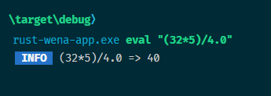

# rust-wena-app

In this test I'm using wena + evalexpr to create an elegant starting point for your console application with sophisticated evaluator that solves equation

```Rust
git clone this repository

cargo run -q -- eval "(32*5)/4.0"
#or directly calling the binary
rust-wana-app eval "(32*5)/4.0"
```

will show the result of equantion  


Extendes the functionalities, just add new commands

```Rust
        .commands([Command::new("sum")
            .description("sum two numbers")
            .definition([Argument::new("first").required(true)])
            .definition([Argument::new("second").required(true)])
            .handler(|app| {
                let first = app.input.argument::<i32>("first").unwrap();
                let second = app.input.argument::<i32>("second").unwrap();
                               
                app.output.write(Alert::info(format!("{}+{} = {}", first, second, first + second )));

                Ok(0)
            })])
```
